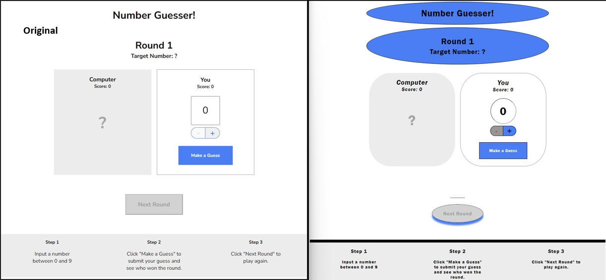

# CodeCademy Project: Number Guesser

## Overview
This is small guessing game project. In this project, you’ll write four functions in `script.js`. CodeCademy provided some additional JavaScript code in game.js that will call your functions based on user interactions. As you complete this project, make sure that all of your functions are named exactly as specified within these tasks so that they can be called correctly when the game is played. The JavaScript functions are incorporated into a website that also uses HTML/CSS.

## The Game
Play against the computer. Pick a number from 0 to 9 and hit `make a guess`, the guess which is closest to the mystery number wins. To go to the next round hit the button `next round`.

<a href="https://tchiagoeisen.github.io/Number_Guesser/index.html" target="_blank">Play the Game</a>

## Credits
This was a project from CodeCademy. The main goal in this project was to write the functions in the `script.js`. 
I also did some changes on the others files.

